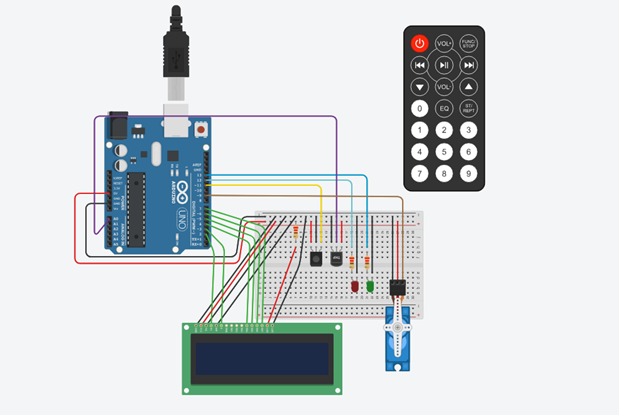

# Parcial-spd
#Alumno: Joaquin Felipe Diaz

#Proyecto Segundo parcial:

#Funcion del proyecto:
El proyecto contiene un display LCD de 16x2 que segun la temperatura detectada por el sensor de temperatura muestra por pantalla la estacion del año y la cantidad de grados. Si llega a superar los 100°C marca que hay un incendio y se prende el led rojo. Luego con el control remoto a traves del boton "on" podemos activar una supuesta manguera que apagaria el incendio, tambien se puede apagar la manguera mediante el control remoto y su boton de "stop". 

#Librerias:
~~~ C 
//Importamos las librerias del servo,control remoto y lcd.
#include <LiquidCrystal.h>
#include <Servo.h>
#include <IRremote.h>
~~~ 

#Variables:
~~~ C
int IR = 11;//pin receptor

Servo myServo;// Establecemos el nombre dek servo
LiquidCrystal lcd(2,3,4,5,6,7);// Establecemos los pines del lcd.
//Definimos los valores predeterminados de las variables.
#define SENSOR A0
#define TECLA_ON 0xFF00BF00 //codigo hexadecimal de la tecla "on".
#define TECLA_STOP 0xFD02BF00//codigo hexadecimal de la tecla "stop".
int led_verde = 13;
int led_rojo = 12;
int lectura;
int grados;
String frase = "";
~~~ 

#Setup:

Inicializamos los dispositivos.

~~~ C
void setup()
{
  lcd.begin(16,2);//Inicializamos la cantidad de caracteres del lcd.
  myServo.attach(9);// Marcamos el pin al que esta conectado el servo.
  IrReceiver.begin(IR,DISABLE_LED_FEEDBACK);//inicio la comunicacion del control con el sensor inflarojo.
  pinMode(led_verde,OUTPUT);
  pinMode(led_rojo,OUTPUT);
  Serial.begin(9600);
}
~~~ 

#Funciones que contiene el proyecto:

loop:

Dependiendo de la tecla presionada se activa la manguera o se apaga y constantemente se  muestra la estacion y la temperatura a traves del display LCD.

~~~ C
void loop()
{
  mostrar_temperatura();
  if( IrReceiver.decode()){//Para cada tecla presionada del control.
  Serial.println(IrReceiver.decodedIRData.decodedRawData,HEX);//Se muestra por pantalla en formato hexadecimal el codigo.
  // al que esta vinculado cada boton.
  if(IrReceiver.decodedIRData.decodedRawData == TECLA_ON){//Si la tecla presionada coincide con el valor establecido se activa el servo.
  refrescar();
  }
  if(IrReceiver.decodedIRData.decodedRawData == TECLA_STOP){
  apagar_manguera();//Si la tecla presionada coincide con el valor establecido se apaga el servo.
  }
  IrReceiver.resume();//Se reinicia el receptor y se prepara para recibir otro código.
  }
}
~~~ 

encender_lcd:
Imprime la estacion y los grados a traves de un display LCD de 16x2.

~~~ C
void encender_lcd(){//Funcion enciende lcd.
lcd.print(frase);//Imprime en el lcd la frase que viene por parametro.
lcd.setCursor(10,1);//Arranca desde el digito 10 para adelante.
lcd.print(String(grados)+" "+"Oc "); //imprime en el lcd los grados que re4cibe por parametro.
}
~~~ 

mostrar_temperatura:
Marca que estacion es segun la temperatura obtenida a traves del sensor de temperatura.
Se utilizan las funciones encender_lcd para imprimir los valores en el display y tambien se utiliza la funcion prender_verde y prender_rojo para prender el led rojo si hay un incendio o prender el verde si no lo hay.
~~~ C
void mostrar_temperatura(){//marca la estacion del año segun la temperatura.
delay(2000);
  lcd.clear();//Limpiamos el lcd para que no se acumulen los datos
  lectura = analogRead(SENSOR);//Lee el sensor
  grados=map(lectura,20,350,-40,125);//Hacemos la conversion a grados
  
  if(grados <=10){//Segun la cantidad de grados las variables toman un valor y se enciender el led que corresponda.
  frase = "Es invierno";
  encender_lcd();
  prender_verde();
  }
  if (grados >=11 && grados<=20){
  frase = "Es otono";
  encender_lcd();
  prender_verde();
  }
  if (grados >=21 && grados<=30){
  frase = "Es primavera";
  encender_lcd();
  prender_verde();
  }
  if(grados >=30&& grados <=99){
  frase = "Es Verano";
  encender_lcd();
  prender_verde();
  }
  if(grados >=100){
  frase = "Incendio!";
  encender_lcd();
  prender_rojo();
  }
}
~~~ 

refrescar:
Gira en 180 grados el servo.

~~~ C
void refrescar(){
  myServo.write(180);//Mueve el servo hacia la posicion de 180 grados.
  
}
~~~ 

apagar_manguera:
Gira el servo en 100 grados. 

~~~ C
void apagar_manguera(){
 myServo.write(100);//Mueve el servo hacia la posicion de 100 grados.
}
~~~ 

prender_verde:
Prende el led verde y apaga el rojo.

~~~ C
void prender_verde(){
digitalWrite(led_verde,HIGH);
digitalWrite(led_rojo,LOW);
}
~~~ 

prender_rojo:
Prende el led rojo y apaga el verde.

~~~ C
void prender_rojo(){
digitalWrite(led_rojo,HIGH);
digitalWrite(led_verde,LOW);
}
~~~ 

## :robot: Link al proyecto
https://www.tinkercad.com/things/4HtTB5nlyKX-segundo-parcial-joaquin-felipe-diaz/editel?returnTo=%2Fdashboard%3Ftype%3Dcircuits%26collection%3Ddesigns&sharecode=Oq2rZtxC0cCJ2BhozzmdAnE3aNzp7IdNLA-x5O8KPgc